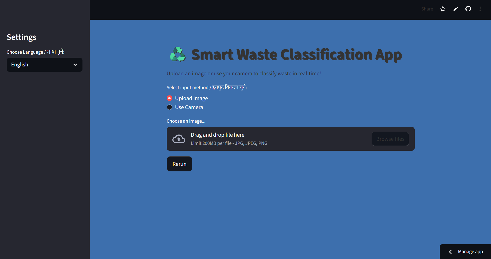
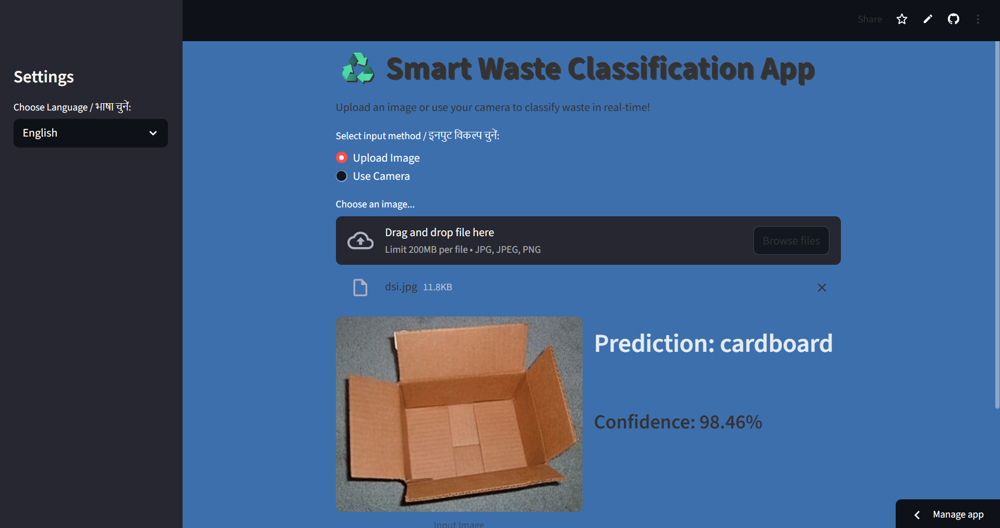
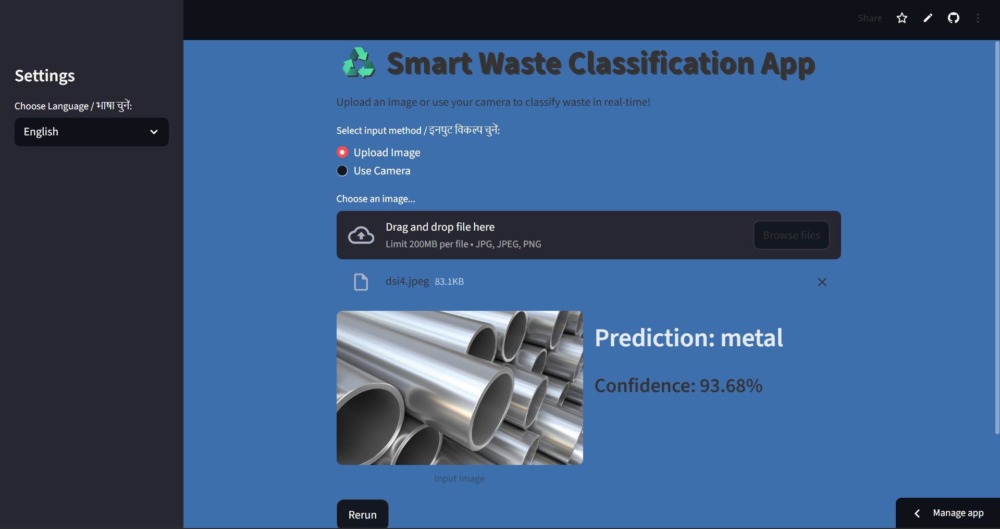

<p align="center">

</p>

<p align="center">
<b>AI-powered waste classification using MobileNetV2 + Streamlit</b>
</p>

## 🚀 Live Demo
🔗 https://smart-waste-classifier-5sbkuevrfz8twxwx3ptdcc.streamlit.app/

# ♻️ Smart Waste Classification App
A Streamlit-based web application that classifies waste into six categories using a MobileNetV2 deep learning model.
---

## Tech Stack  
<p align="left">


</p>

## Features

- Upload an image of waste or take a photo using your camera
- Real-time waste classification
- User-friendly interface with clean styling
- Confidence score for predictions
- MobileNetV2 model with data augmentation
---

## Waste Categories

The model classifies images into the following classes:

- Cardboard

- Glass

- Metal

- Paper

- Plastic

- Trash

---

## Installation

1. Clone the repository:

```
git clone https://github.com/Akanksha-Nadipalli/smart-waste-classifier.git
```

2. Navigate to the folder:

```
cd smart-waste-classifier
```

3. Create a virtual environment (optional but recommended):

```
python -m venv env
source env/bin/activate # Linux/Mac
env\Scripts\activate # Windows
```

Install dependencies:

```
pip install -r requirements.txt
```

## Usage

Run the Streamlit app:

```
streamlit run app.py
```

Open the provided URL in your browser and start classifying waste.

## 📸 Screenshots

### Home Page


### Classification Result



## 🧠 Model Information

Model file: garbage_mobilenet_augmented.keras

Architecture: MobileNetV2 (pretrained on ImageNet)

Training: Includes extensive data augmentation for robustness

Output: Six waste categories with prediction probabilities

## 📄 License

This project is licensed under the **MIT License**.  
You are free to use, modify, and distribute this project with appropriate attribution.

See the [LICENSE](./LICENSE) file for full details.
