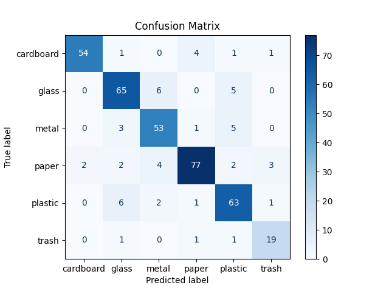
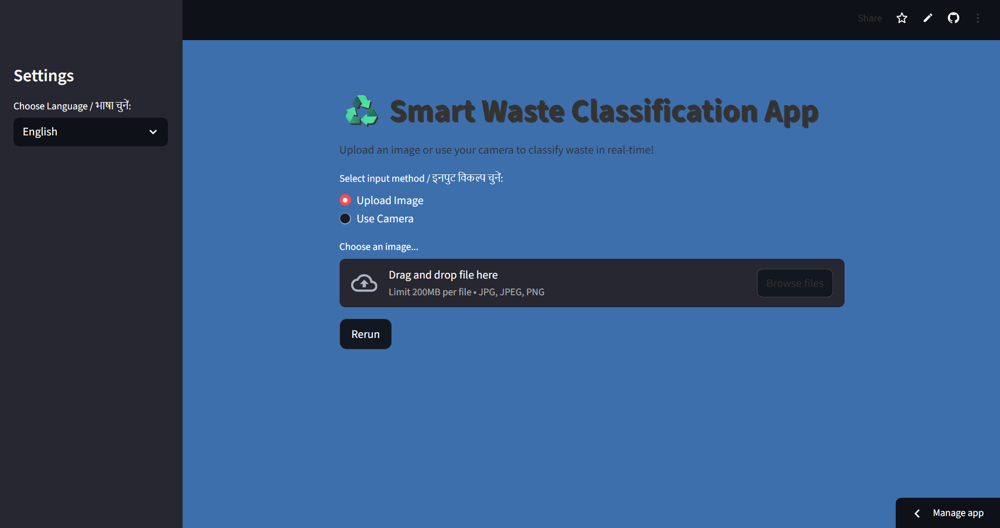
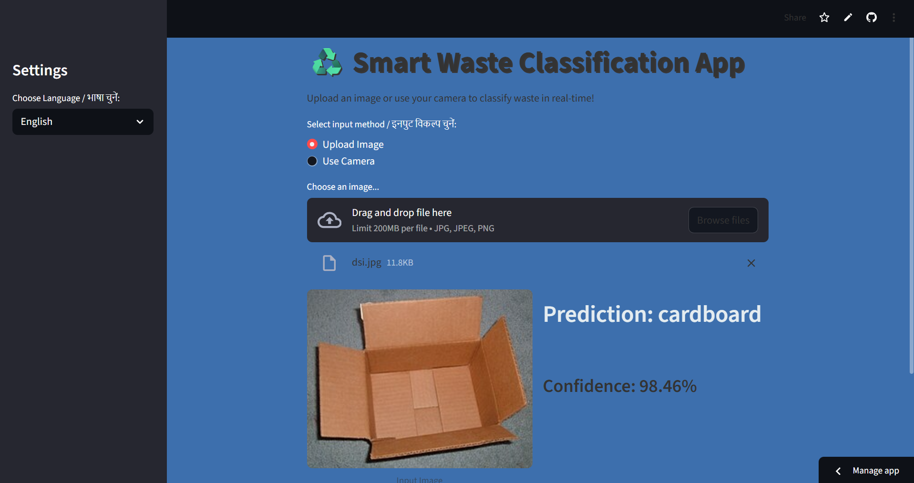
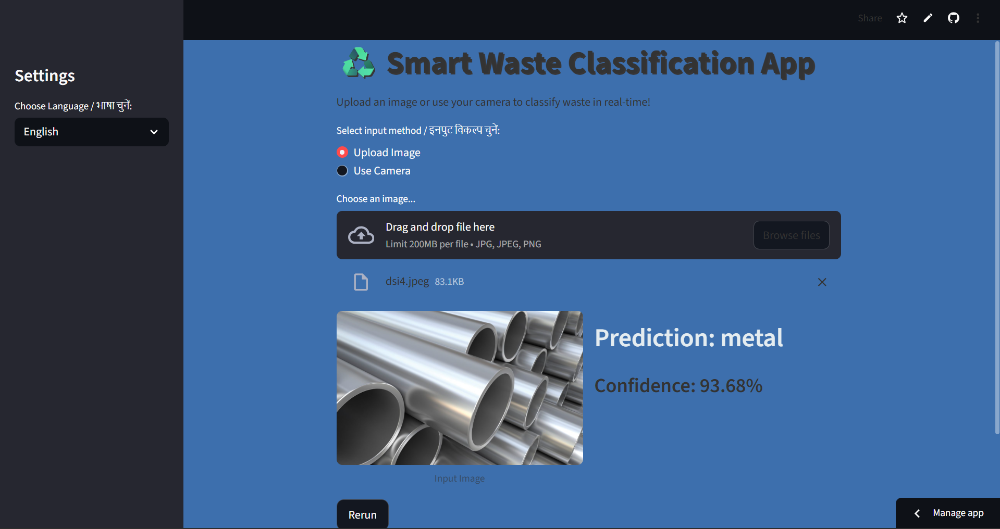

<p align="center">  </p> <p align="center"> <b>AI-Powered Waste Classification using Transfer Learning with MobileNetV2 </b><br/> Turning trash into structured data for smarter recycling ♻️ </p>

## 🚀 Live Demo

🔗 https://smart-waste-classifier-5sbkuevrfz8twxwx3ptdcc.streamlit.app/

## ♻️ Smart Waste Classification App
An end-to-end Deep Learning project that classifies waste images into six categories using Transfer Learning with MobileNetV2 and deploys the model as an interactive Streamlit web application.
Achieved 86.2% test accuracy on a challenging real-world waste dataset.

## 🧠 Problem Statement
Improper waste segregation is a major challenge in recycling systems. Manual sorting is inefficient and error-prone.

This project uses Deep Learning to automatically identify waste type from an image, forming the foundation for smart recycling systems and IoT-based smart bins.

🛠️ Tech Stack
<p align="left">      </p>

## 🗂️ Waste Categories

• The model predicts:

• Cardboard

• Glass

• Metal

• Paper

• Plastic

• Trash

## Dataset

TrashNet — a noisy, real-world dataset with visually overlapping classes.

## 🏗️ Model Architecture

Transfer learning with MobileNetV2:

• Input resolution: 320×320

• Frozen convolutional base

• Custom classification head

• Strong data augmentation

• Fine-tuning of top layers

• Label smoothing + early stopping

## 📊 Model Performance

Test Accuracy: 86.2%
This performance reflects real-world challenges due to class similarity and background noise in TrashNet.

## Confusion Matrix: 




## 📸 Screenshots

### Home Page


### Classification Result



## Installation

1. Clone the repository:

```
git clone https://github.com/Akanksha-Nadipalli/smart-waste-classifier.git
```

2. Navigate to the folder:

```
cd smart-waste-classifier
```

3. Create a virtual environment (optional but recommended):

```
python -m venv env
source env/bin/activate # Linux/Mac
env\Scripts\activate # Windows
```

Install dependencies:

```
pip install -r requirements.txt
```

## Usage

Run the Streamlit app:

```
streamlit run app.py
```

Open the provided URL in your browser and start classifying waste.

## 📄 License

This project is licensed under the **MIT License**.  
You are free to use, modify, and distribute this project with appropriate attribution.

See the [LICENSE](./LICENSE) file for full details.
